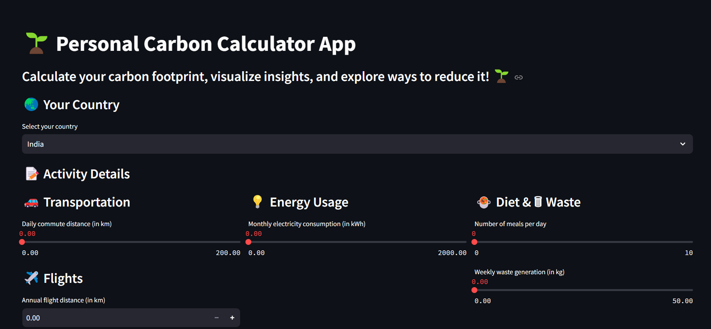
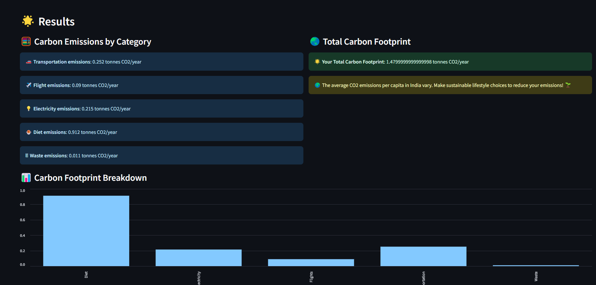

# GreenFootprint - Personal Carbon Footprint Calculator

GreenFootprint is a web app that helps users calculate and track their carbon footprint based on daily activities like transportation, energy use, diet, waste, and flights. It provides insights into emissions, helping users make sustainable choices to reduce their environmental impact for a greener future.

## Features

- **Country Selection**: Choose from multiple countries (India, USA, China, UK, Germany).
- **CO2 Emissions Calculation**: Input data for transportation, energy, diet, waste, and flights to calculate emissions in tonnes per year.
- **Visual Insights**: View graphical representations of emissions breakdown by category (Bar charts and Pie charts).
- **Top Emitters**: Identify the top contributors to your carbon footprint and receive tips on reducing them.
- **Educational**: Learn about global and country-specific emission averages.

## Live App

You can access the GreenFootprint app here: [GreenFootprint - Live App](https://greenfootprint.onrender.com)

## Technologies Used

- **Streamlit**: For building the interactive web interface.
- **Python**: For calculations and backend logic.
- **Matplotlib**: For creating graphs and charts.

## Setup Instructions

1. Clone the repository:
    ```bash
    git clone https://github.com/your-username/greenfootprint.git
    cd greenfootprint
    ```

2. Install the required dependencies:
    ```bash
    pip install -r requirements.txt
    ```

3. Run the app:
    ```bash
    streamlit run app.py
    ```

4. Open the provided local URL in your browser to use the app.

## Screenshots


*Example of the app's homepage interface.*


*Bar chart showing CO2 emissions by category.*

## Contribution

Feel free to fork this repository, make improvements, and submit pull requests.

## License

This project is licensed under the MIT License - see the [LICENSE](LICENSE) file for details.

## Acknowledgements

- Thanks to the contributors and libraries used in building this app.

---

Made with ❤️ by Aditya
